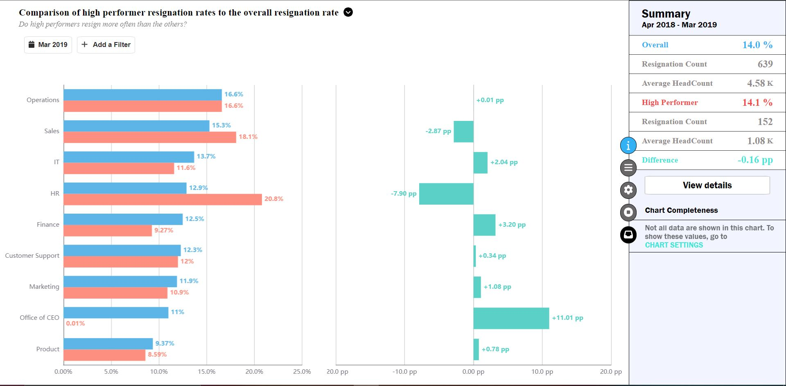

# Echarts-Comparison

## Description
### Build Echarts Curves with:-
- Plot the curve using ECharts library in React.
- Two Curves which shows the relation between resignation and high performance employees.
- Display the curves summary. 
- Make custom labels for the curve.
- Developed a responsive UI which works in any screen size.

## See Live Demo
- Hosted the application on <a href="https://www.netlify.com/">Netflify</a>.

### visit --> https://echarts-ishanjain.netlify.app/

## Screenshots

  
Home Page

  

## Technologies Stack:

- React.js
- TypeScript
- Echarts
- HTML
- CSS

### How to install
- Install and setup Node.js in your machine. Follow instructions according to your machines from <a href="https://nodejs.org/en/download/">here</a>.
- Clone the project onto your Machine.
- Open the terminal and navigate to the folder (echarts-comparison) in the termninal.
- Run the following commands

~~~
cd .\echarts-comparison\
npm install
npm start
~~~

- Our React App will run on port 3000.
- Go the browser and go to <link>http://localhost:3000/</link>
- That's it now project is ready for use.